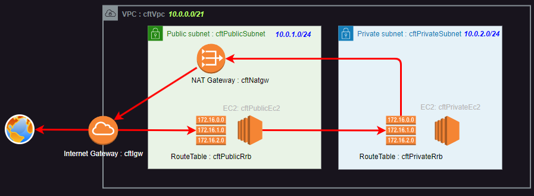

# AWS CloudFormation Tutorial

Tutorial for practicing CloudFormation. Create the following configurations:



# settings

1. Setting local Environment

    - Install AWS CLI.

      [https://docs.aws.amazon.com/ja_jp/cli/latest/userguide/getting-started-install.html](https://docs.aws.amazon.com/ja_jp/cli/latest/userguide/getting-started-install.html)

    - Set AWS Access Key to local Environment.
      > ps> aws configure

2. Create a KeyPair named cf-tutorial-ec2-key in the AWS Management Console.

3. Set the IP address of the source that allows the connection.

    Rewrite the following parts of the template file.

    ``` yaml
    # SecurityGroup(public EC2)
      cftPublicEc2Sg:
        Type: AWS::EC2::SecurityGroup
        Properties:
          GroupName: cf-tutorial-public-ec2-sg
          GroupDescription: Allow SSH Access.
          VpcId: !Ref cftVpc
          SecurityGroupIngress:
            - 
              IpProtocol: tcp
              FromPort: 22
              ToPort: 22
              CidrIp: xxx.xxx.xxx.xxx/32   # Set the IP address of the source that allows the connection.
    ```

## deploy CloudFormation Template

- git clone this repository.
  > ps> git clone xxxxxx

- Type Command on Powershell.
  > ps> aws cloudformation deploy --template-file ./cf.yaml --stack-name cf-tutorial

## delete CloudFormation Stack

- Type Command on PowerShell.
  > ps> aws cloudformation delete-stack --stack-name cf-tutorial

